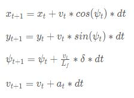

# CarND-Controls-MPC
Self-Driving Car Engineer Nanodegree Program

---

## Model Predictive Controls

MPC is a method used in self-driving cars for actuating the vehicle. In simpler terms it applies the driving decisions (steering angle and throttle) to the car. This is not a simple feat. A neural network deciding a specific steering angle, is using the current state of the car and environment to do so. Thus the decision concerns a timepoint in the past. Moreover, there is inherent latency in applying that command to the the car. Consider also the complexity of driving with variable biases and acceleration which directly affect the state and error.

Traditionally, the type of controller used is a PID controller. MPC differs from PID by inclusding a model of the vehicle. That model can be simplistic by ignoric several forces (i.e. gravity) and vehicle characteristics (mass, tires) and is called Kinematic. It can also be augmented to account for all potential factors, perfecting accuracy and improving the potential for agility; sudden drastic changes in vehicle state and behavior can cause great inaccuracy in a simple model.

A Kinematic model has several benefits over a Dynamic model:
* It is computaionally lighter allowing real-time execution in a car with a cost effective hardware setup.
* It is portable between vehicles. Since it is agnostic of several car specific properties, implementing in different vehicles requires minimal reengineering 

It also has constraints:
* Cannot handle scenarios that require abrupt extreme changes in vehicle trajectory and state.

This project concerns the development of a Kinematic MPC for the [Udacity simulator](https://github.com/udacity/self-driving-car-sim/releases)

## Implementation

### Coordinate system

An integral part is the transformation of waypoints from the map coordinate system to the car's coordinate system. This localizes the state to the car and simplifies overall calculations.

```
ptsx_transformed( i ) = dX * cos( minus_psi ) - dY * sin( minus_psi );
ptsy_transformed( i ) = dX * sin( minus_psi ) + dY * cos( minus_psi );
```

### Calculating trajectory

The localized waypoints were then used to calculate a trajectory for the car to follow. The waypoints were fitted into a 3rd order polynomial by using regression. The simulator presents this trajectory via a drawn yellow line.


### Calculating the error CTE and ePSI


The following equations were used to calculate the Cross-Track Error (CTE) and the Angular Error (ePSI)


### Motion Model

The model was based on the following state:

* x the X coordinate of the vehicle
* y the Y coordinate of the vehicle
* psi the angle of the vehicles trajectory
* v the vehicles velocity

Further, two inputs were used to model the actuators steering and throttle

* delta the magnitude of steering
* a the magnitude of throttle

The following equation were used to update the state:




### Time step length (N) and interval (dt)

The values selected were

* N = 10
* dt = 0.1

Overal the model requires data that are dense over time without much overlap. Of course this balance is also dependent to the speed of the car since it affects the span of a timestep in the physical world. Hense, my intuition is that these values shgould be dynamically calculated relative to the speed. Nonetheless the aforementioned values gave good results with a large range of speeds and this is why I selected them.

### The cost function

The cost function was designed to optimize according to the following principles
    
* Minimize CTE to zero
* Minimize EPSI to zero
* Enable speeds up to 100mph.

Some practical comments about the implementation

* The effect of errors ePSI and CTE were enlarged to maintain the car in the middle of its lane
* Initial delta and a prameters were reduced to mitigate motion instability
* Delta and a value changes were smoothed to reduce oscillations
* The overal ride was smoothed out by reducing both speed during turns and steering at high speeds


### 100ms latency

To account for latency the controller was made to perform one time step in the future. This was implemented by predicting the next state which was fed into the MPC solver for steering and throttle.


### Outcome

The car is able to drive around the track flawlessly and safely at speeds that reach almost 100mph.


## Running the project

### Dependencies

* cmake >= 3.5
 * All OSes: [click here for installation instructions](https://cmake.org/install/)
* make >= 4.1(mac, linux), 3.81(Windows)
  * Linux: make is installed by default on most Linux distros
  * Mac: [install Xcode command line tools to get make](https://developer.apple.com/xcode/features/)
  * Windows: [Click here for installation instructions](http://gnuwin32.sourceforge.net/packages/make.htm)
* gcc/g++ >= 5.4
  * Linux: gcc / g++ is installed by default on most Linux distros
  * Mac: same deal as make - [install Xcode command line tools]((https://developer.apple.com/xcode/features/)
  * Windows: recommend using [MinGW](http://www.mingw.org/)
* [uWebSockets](https://github.com/uWebSockets/uWebSockets)
  * Run either `install-mac.sh` or `install-ubuntu.sh`.
  * If you install from source, checkout to commit `e94b6e1`, i.e.
    ```
    git clone https://github.com/uWebSockets/uWebSockets
    cd uWebSockets
    git checkout e94b6e1
    ```
    Some function signatures have changed in v0.14.x. See [this PR](https://github.com/udacity/CarND-MPC-Project/pull/3) for more details.

* **Ipopt and CppAD:** Please refer to [this document](https://github.com/udacity/CarND-MPC-Project/blob/master/install_Ipopt_CppAD.md) for installation instructions.
* [Eigen](http://eigen.tuxfamily.org/index.php?title=Main_Page). This is already part of the repo so you shouldn't have to worry about it.
* Simulator. You can download these from the [releases tab](https://github.com/udacity/self-driving-car-sim/releases).
* Not a dependency but read the [DATA.md](./DATA.md) for a description of the data sent back from the simulator.


### Basic Build Instructions

1. Clone this repo.
2. Make a build directory: `mkdir build && cd build`
3. Compile: `cmake .. && make`
4. Run it: `./mpc`.

